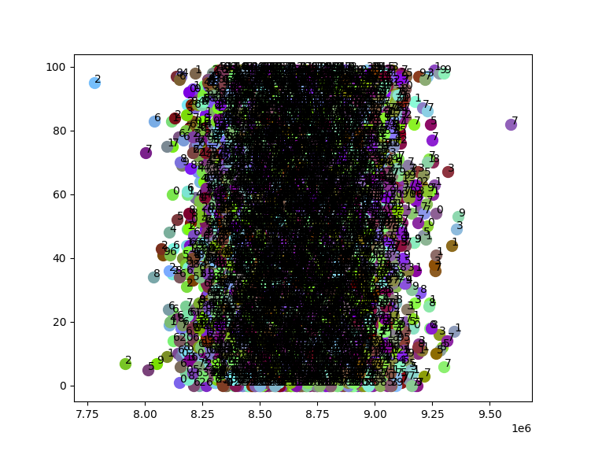
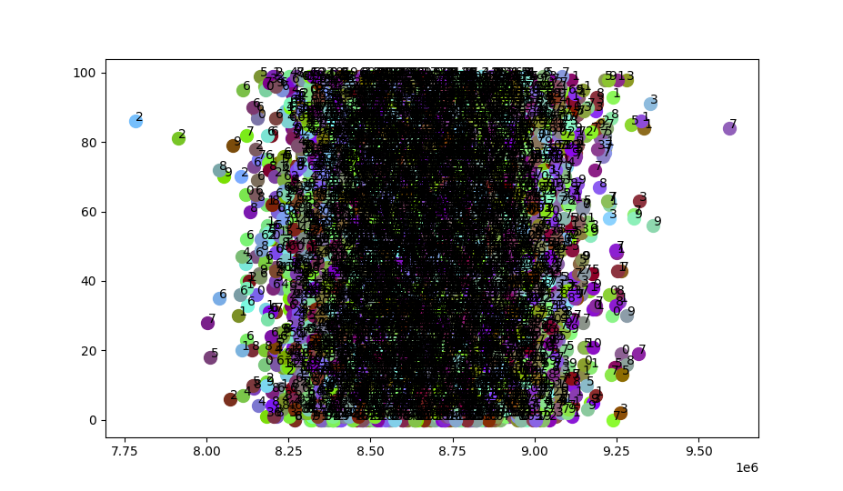

# AVERAGE PIXELS clustering
Task chosen - MNIST

### Hypothesis
_Similar numbers are placed in similar locations, so there are almost
identical sets of active receptors(receptors here are input image pixels)
for equal numbers._

### Algorithm
I don't want to apply complex methods for clustering numbers. I want to 
'see' clusters just by active receptors. To 'see' clusters I have decided
to set a unique <r>color</r> for each receptor. And mix colors of active
receptors. I expect to get clusters by different colors for different
numbers.

### Results
Just average colors with labels:

Average colors with labels using remembered active receptor sets:

### Conclusion
It seems like numbers are too different: some are too stretched, some are too squeezed.
This makes proposed algorithm not beeing able to cluster numbers correctly.
